# The beginning

I only really started learning about cars in 2015, when my roommate was doing a fix on his 1971 dart.

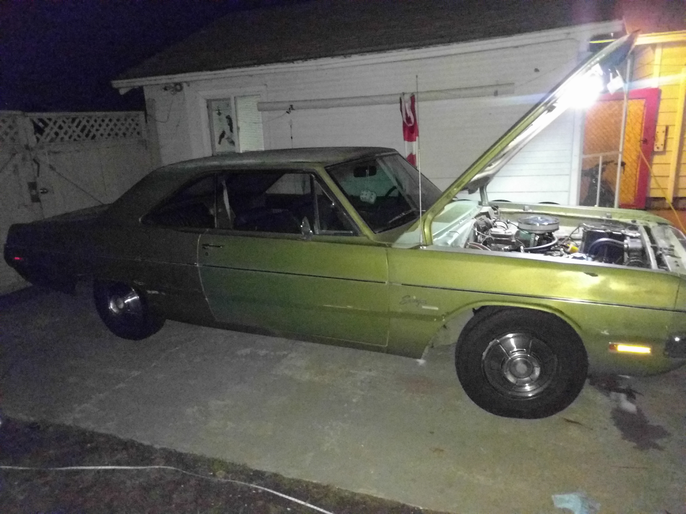

The engine was nice and open, with lots of space. Unlike
modern cars, it was fairly easy to tell where things
were and what they were.

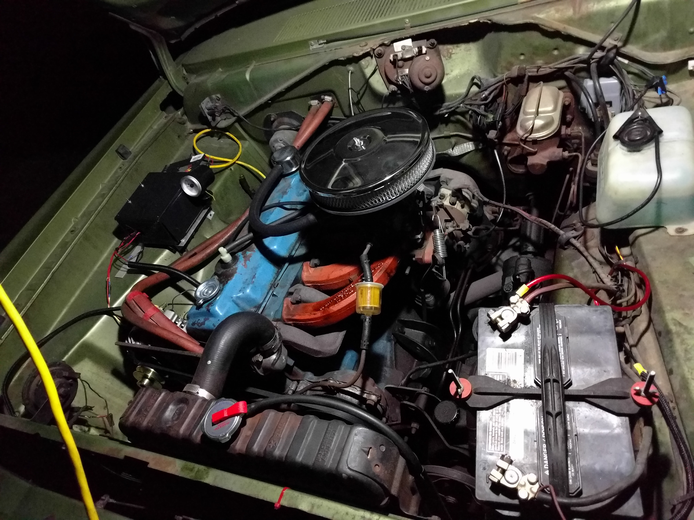

The modification he was doing was replacing the distrubutor.
It was a switch from the points system to a magnetically
triggered one. You can see our hack-job in the computer
power supply case attached. It worked darned well.

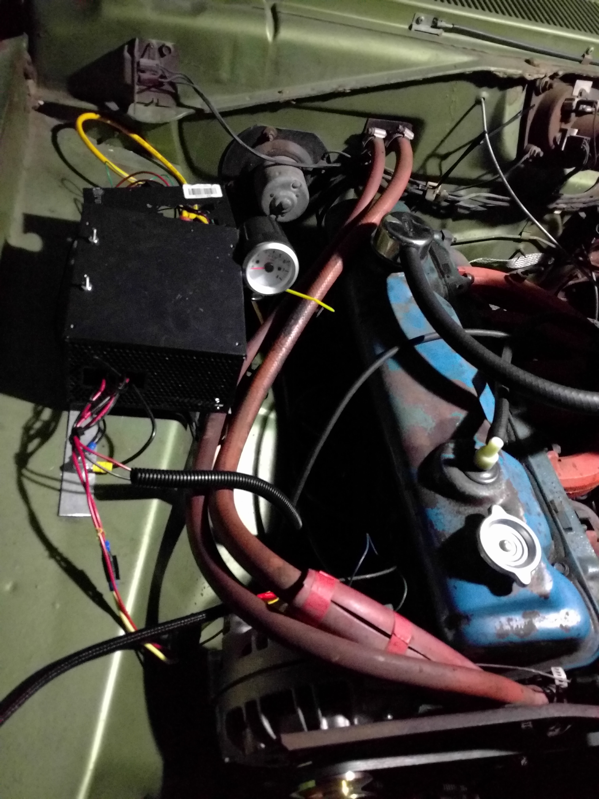

# My first car

A while later, after breaking my arm and not being able
to ride any of my 2-wheeled vehicles, I bought my first
car. It is a beautiful 1989 GMC Suburban. I call it Rosie.

The down side with buying an old car is they sometimes
break down. My first week having it, it broke the steering
arm connection to the knuckle in a parking lot in Vegas.

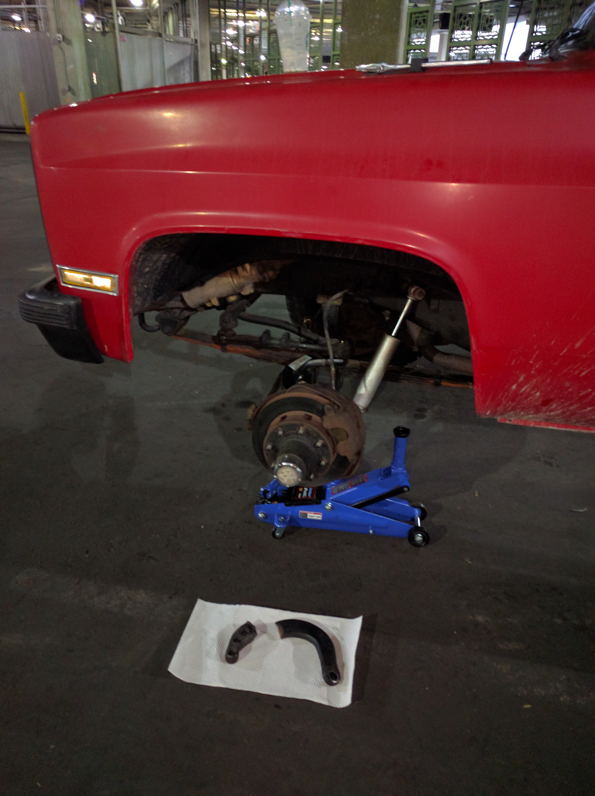

That dove me into the deep end, because I fixed the car,
in that parking lot, and with a broken arm. At the end of
those 6 or so hours I knew a lot more about my car and had
a lot more car-appropriate tools.

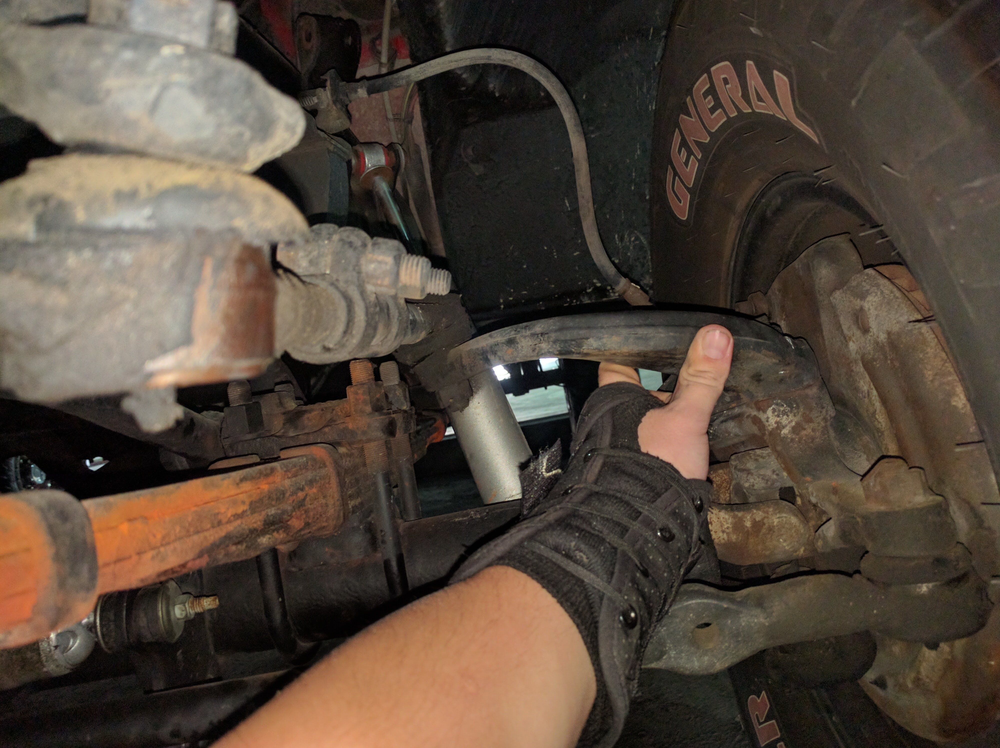

# Offroading

I bough a car all fitted for offroading, so it seemed like
a shame if I didn't take it offroading. I've now developed
quite a fondness for the sport. The car is quite capable,
and I'm learning where driver skill matters. There are some
trails I've taken it down that when I started I would never
have been able to make it, or would have flipped the car!

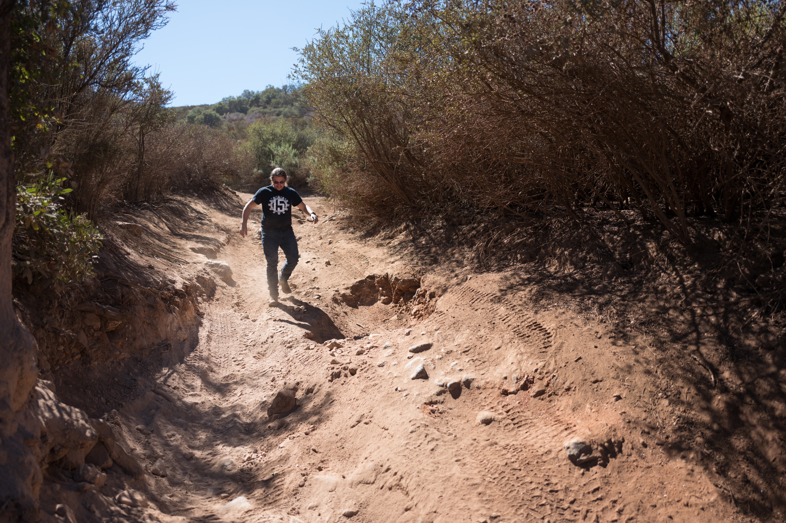

I've even had to tow a friend's car to the road. In this
case, after a glorious jump, he broke a driveshaft. I 
McGyver'ed a jig using ratchet straps to hold it up so
I could tow him back to the campsite.

It was quite a break!

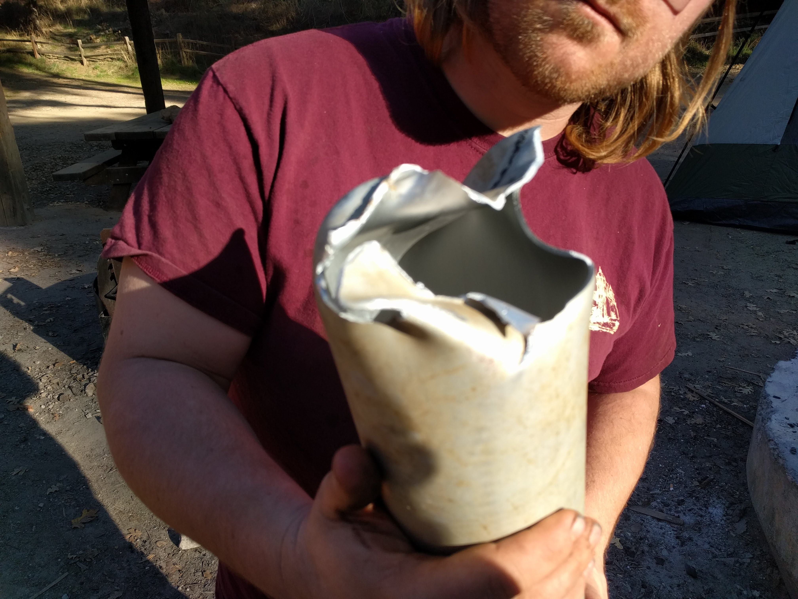

I'm not always able to drive home however. On one
particularily hot day, I turned too hard while jammed
on a rock and blew up my steering pump. Got a tow
home instead of risking it on the highway. Good thing
I had AAA with 200 mile towing!

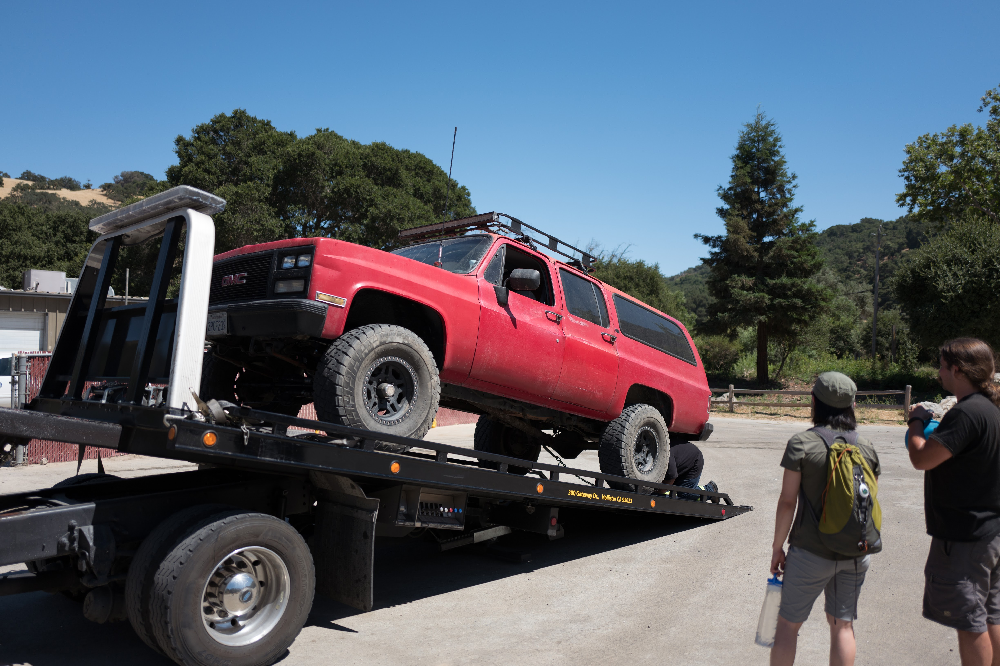

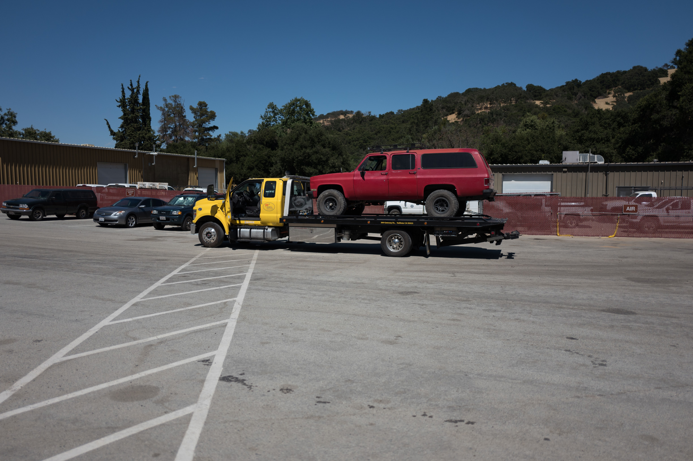

# Symbiosis

It has been useful having both a truck and a motorcycle.
I've had it that my motorcycle battery has died, and
needed to jump it. I will say, they are not designed to make
that easy, but it all worked out in the end!

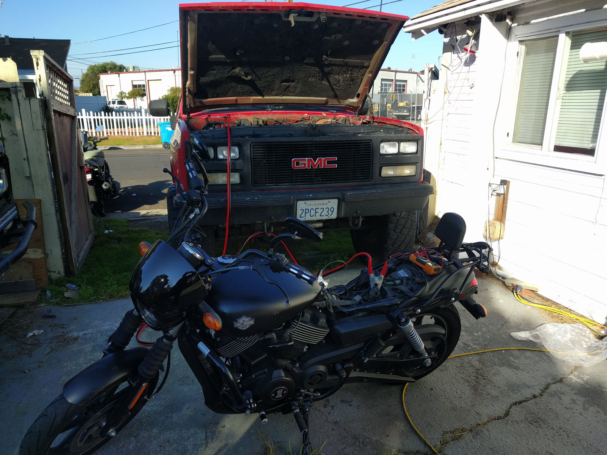

# Cross country drive

As a testemant that old cars can still perform, I drove
my truck cross-country towing my motorcycle. I even
took it on the salt flats. How did my attempt at a land
speed record go? I hit 60mph! That's towing a trailer!
How fast was I going on the freeway? At least 70mph. Salt
can add a lot of drag when damp.

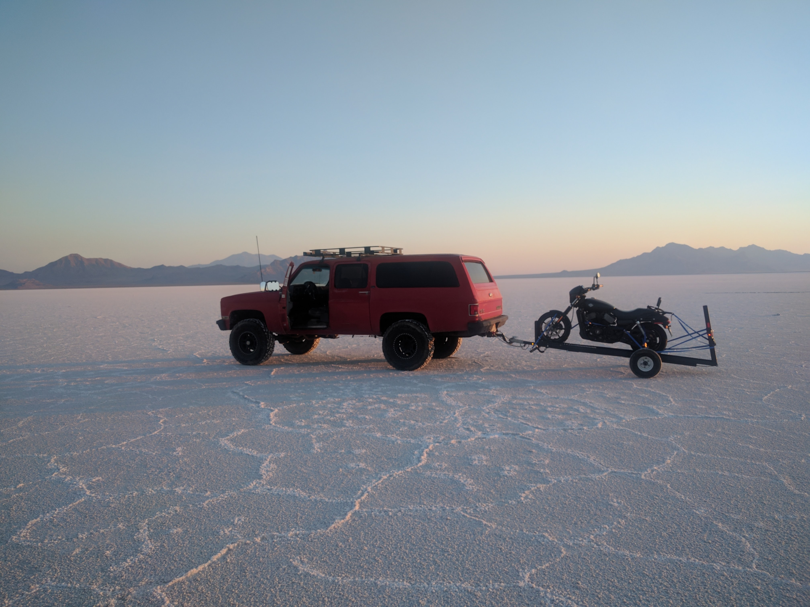

# Other

I've also towed my friends 1955 Jeep some way with my truck,
right before the motor started to make some nasty sounds
(grinding bearing in the motor. Bad). Next step will
be replacing the engine.

I did get to drive my friends Jeep though. No pictures, but
it was a blast! No roof, no doors, fold-down windshield - 
may get one myself one day ;)