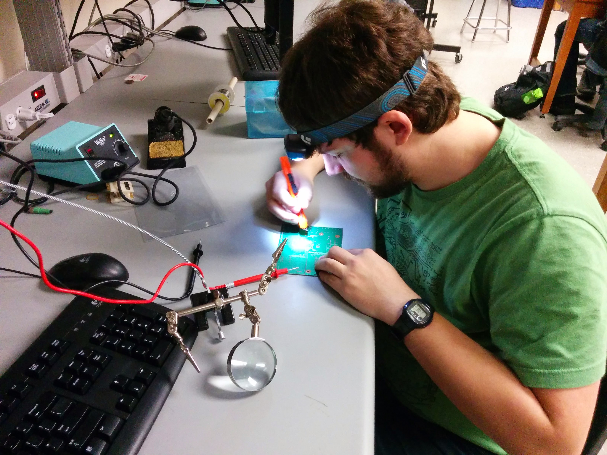

Ebike has taken a major part in my life. Ever since
my friend said "Hey, we could build an ebike", I've
spent a lot of time with them and have learned a
lot from them. Here is an overview of some of
what I've experience with ebike.

# First ebike - v1
My first ebike was designed to pull a trailer. The
though was one person could ride the bike, and two would ride in the trailer. We could then go about
campus more easily! The trailer hitch never worked
out, but we got a prototype working.

The ebike had a Crystalyte Crown rear motor, with
a 60V LiFePO4 battery and a 40A controller. Lots of
power on a little moutain bike frame. It could 
*move*.

The first itteration had the batteries in a suitcase
mounted on the rear rack. The advantage to this was the batteries were very easily removable. It used
Anderson Powerpole connectors for easy connections.

This had the downside of being quite unstable. The
high center of gravity with with batteries so high,
as well as being far back and not rigidly attached,
caused the bike to become unstable in cornering.
I ran into many snowbanks during initial testing.

# First ebike - v2

I moved the batteries down and further forward. 
To do this while still allowing
peddaling, the batteries needed to be very close
to the frame. I placed them inside the frame and
up near the handlebars, using duct tape as
structure. The batteries were wrapped in plastic
for water proffing, and an inner tube provided
additional strength for the upper batteries.

Believe it or not, this ebike could go *fast*. The
top speed I ever hit on it was 76km/h on level
ground. That terrifies me now, but started an
addiction to ebikes that has never stopped. It
worked like a champ until I dissasembled it
for my move to California, as the frame was worse
for wear due to being subjected to a couple of 
harsh Waterloo winters.

# Fat bike - v1
I've like the idea of having an electric
fat bike, as the main down side to fat bikes
is their rolling resistance. So I bough a shiny
new fat bike from Target. It was not a great bike,
but served a good platform.

I took the guts from my first ebike and made sure
they were working and would fit on the fat bike.

I then took the rear wheel and re-spoked it with
the Crystalyte Crown motor.

I then strapped the electronics and batteries to the front of the bike and decided to see how it
rode! It was a bit unstable, but a lot better
than having the batteries at the back.

# Fat bike - v2

The first fat bike was great, and I rode it for a
bit, but it was not stable enough to do hard
ridding with. So it was in need of a mechanical
overhaul.

My friend and I put together a battery container
attached to the frame, which rigidly holds the
batteries in place and can be taken appart. It
also allows for better wire managment.

It turned out quite nicely. Even jumped it a few times! Because it used the same parts as my
previous ebike, it could go dangerously fast.

# Fat bike - v3

V2 may have had *too* much power however, because
it ended up shearing an axle during acceleration.
This was partially due to a loose torque arm, so
I've been sure to check those on a regular basis
since then.

I replaced the motor with a Cromotor, which was
wound for lower speed but higher torque.

# Frost-e-bike

For my fourth year design project, me and my team
of 3 build a fully-featured electric bicycle for
use in snowy winters. It was a tricycle with all-wheel drive, no chain, and all sorts of algorithms and amenities. For some more information,
see [Frost-e-bike website][].

We started with ideation, making wood models
of all the different designs we could come up with
from what we'd seen and could imaging. The winner
was a basic delta trike design.

We then went through the process of building
it. It was all from scratch. We even tried using PCBs built in-school, but they ended
up having issues. This was me trying to
debug one.

All of the electronics were custom, so we did a lot of
bench-top testing. Here is one test setup!

This thing also had the largest capacitor in it that I
have ever helt. 80V 0.1F. Here's a picture.

We systematically put the bike together.

Eventually, we got it together.

Then we took it for a ride!

There were definitely some ups and downs during development,
but in the end we had something that was stable on ice
and could haul.

# Scooter

A friend enlisted my help doing some development work
on a scooter. I had never used a comercial electric
scooter before, so it was quite interesting working on
it!

It started all shiny in new in a crate.

And I took it appart to see how it worked. Upgraded the
battery to a Li-ion battery, more powerful controller,
and took off all the body panels. This is a WIP, but
still better than the original.

# Legal ebike

There is one ebike I built during the scooter project
that I joke is the only *technically* legal ebike I
have ever built, as it meets the power ratings of the
area I was in. It is a little 1kW kit that is on an
Iron Horse frame. It is relatively slow, but useful
for getting around.

![legal_1.jpg]

Legal, however, does not mean it's the safest. In fact,
it's the only one I've ever hurt myself on. Riding it
was the only time I've ever broken my arm!

# More power!

In the end, I made the logical leap to a motorcycle.
They are safer in the end because they are actually
designed mechanically for the power and speeds, while
the systems I had built were capable of more than the
frame designer had ever intended.

My first motorcycle is a Harley Street 750, and I do
love the acceleartion!

They are not invulnerable however, and I did lay it down
going 10mpg. They are much more fragile when layed down
due to the weight, and this minor incedent bent the handle
bars.

Nothing a vice, some tubing, and some elbow grease couldn't
fix however!

[Frost-e-bike website]: http://www.eng.uwaterloo.ca/~pimacdon/ "Frost-e-bike"