# Tranformations in hair

I have tried out a few different facial and head
hair styles over time. I like to change things
up every once in a while. This is a summary of
my journey since I started taking pictures (cell
phones are great things).

It started with a clean cut, in 2015 when I
graduated University. Here I am with my buds.

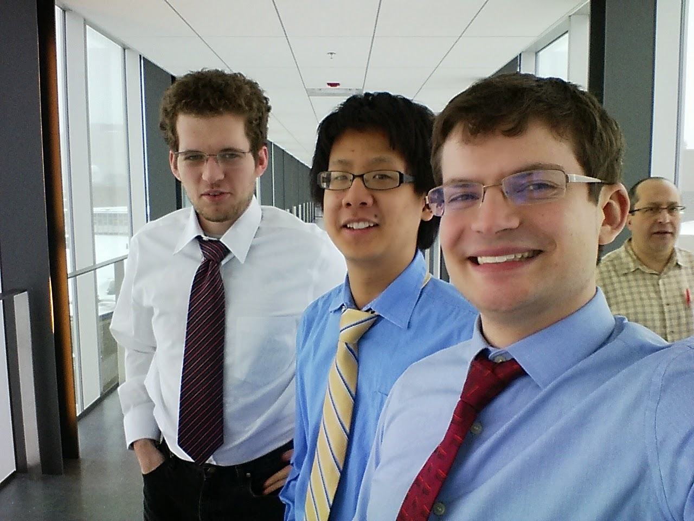

Then I moved to California, and started the journey
of growing out my hair. Goal: Long hair, long beard.
I wanted to be able to maintain my own hair, no
barber needed. I slowly learned everything needed
to maintain every haircut in the middle, and it's
not as simple as I first thought.

Started easy, with a nice mustache curl.

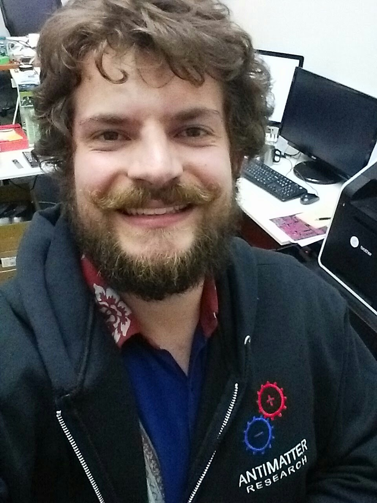

Then grew more, learning about pomade and beard
balm.

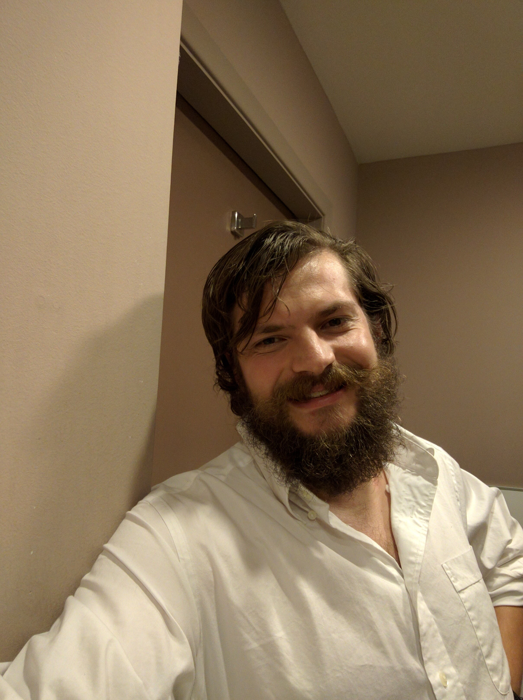

It kept going. I bought a motorcycle, and rode to 
Tahoe on the first weekend. Note the dent in the
beard from my helmet!

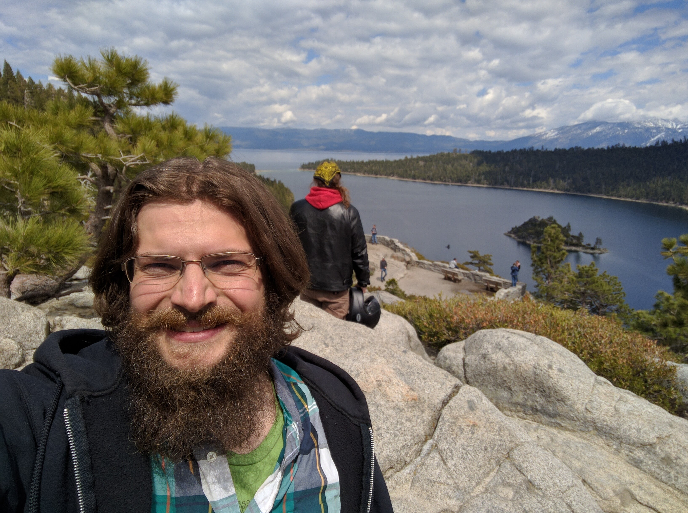

I became a pretty hard core riding dude on my 
Harley, and kept growning. Added the bandana to
keep the hair out of my face while looking cool.
This is about as big as I grew my beard.

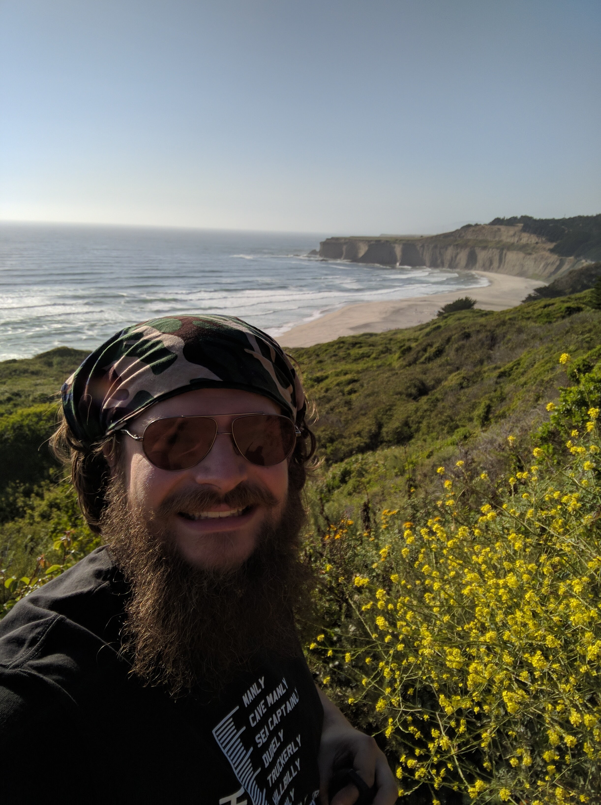

Afterwards I trimmed my beard here, good enough
for a starship captain! This is a bit blury,
for national security reasons of course.

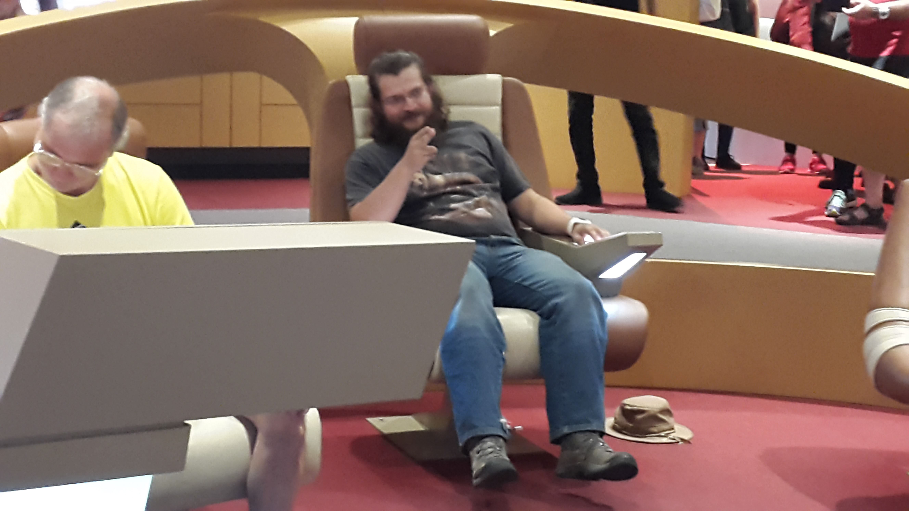

I kept my beard nice and trimmed but long, letting
my hair grow longer. Letting my beard grow longer
made it a bit wispy, and I didn't like that. This
is the most adveturer I ever looked!

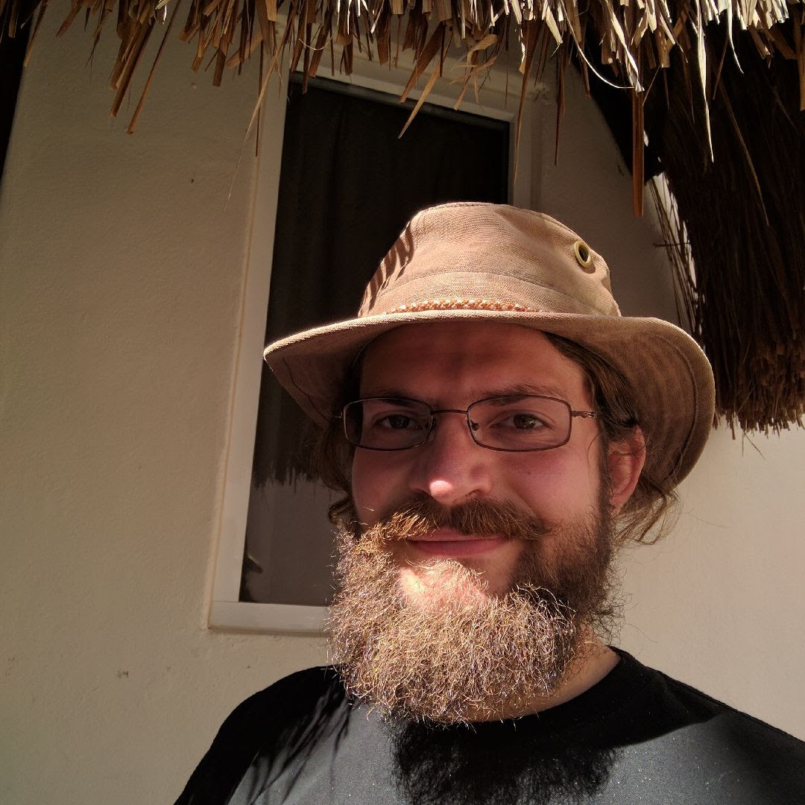

Then I went crazy. Dramatic change, mutton chops!

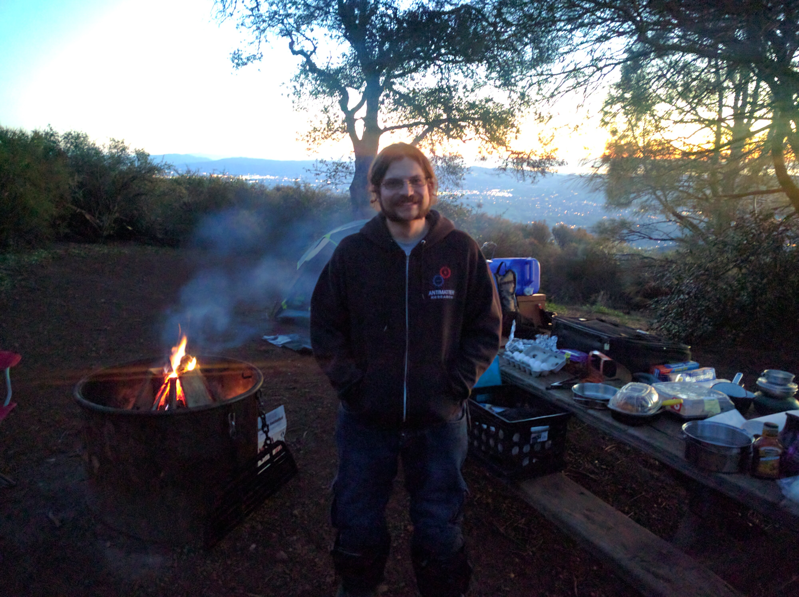

I trimmed the mutton chops, and rocked the mustache.
It got pretty big. Here I am, a little unshaven.

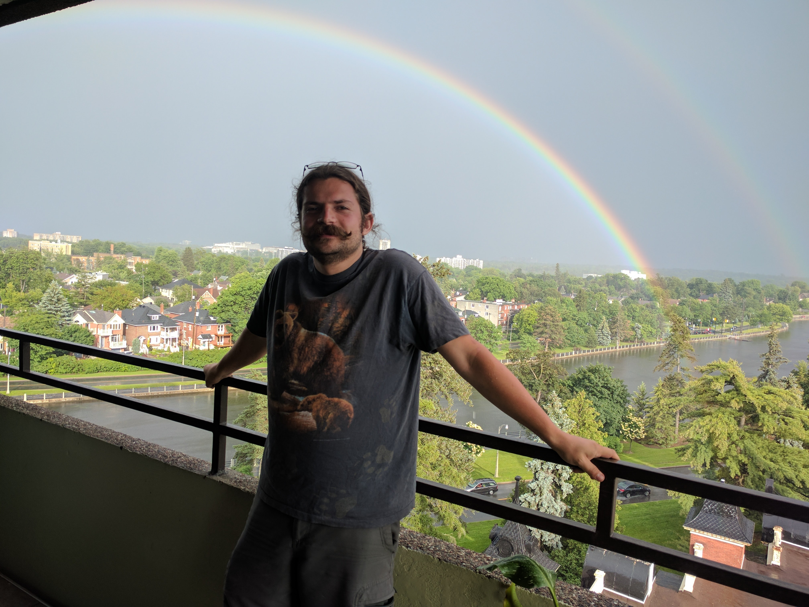

At this point, things had really changed! See the
difference between my first time at the salt flats
in 2015, vs the second time in 2017.

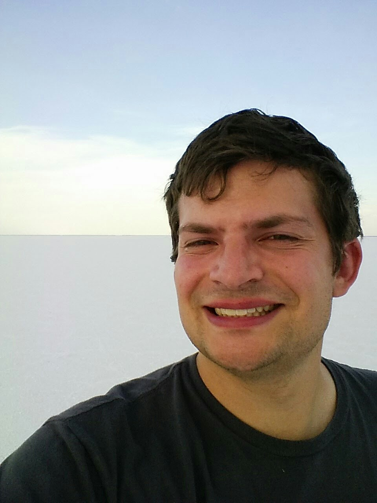
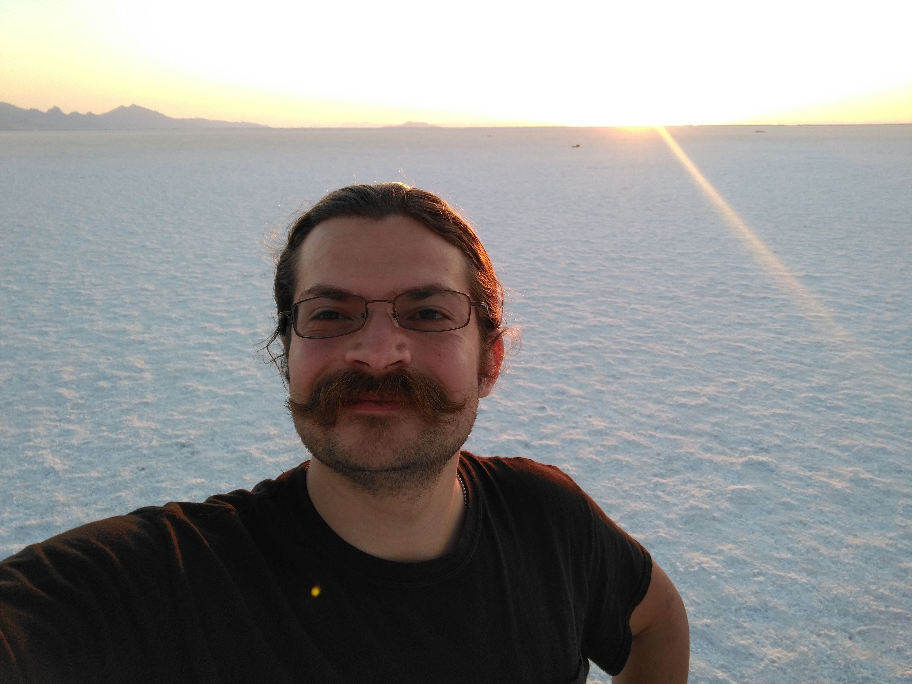

I then decided to drop the mustache so I could eat
more easily, and went with the goatee. This is a 
look I liked and could maintain.

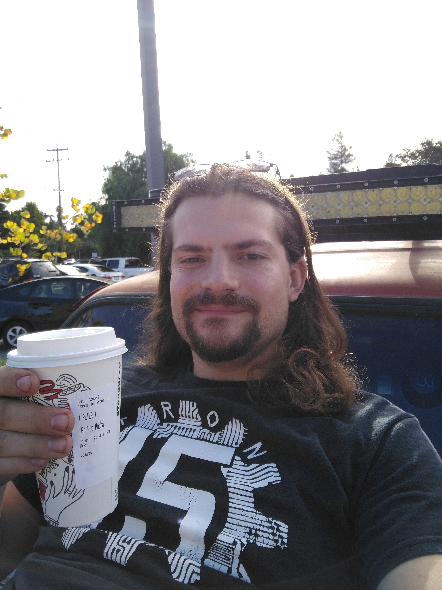

This was a great adventure with long hair. In the
end, I was satisfied with the experience, and
decided it was time for a change. And so it went.
<Picture to be inserted once I shave.>
